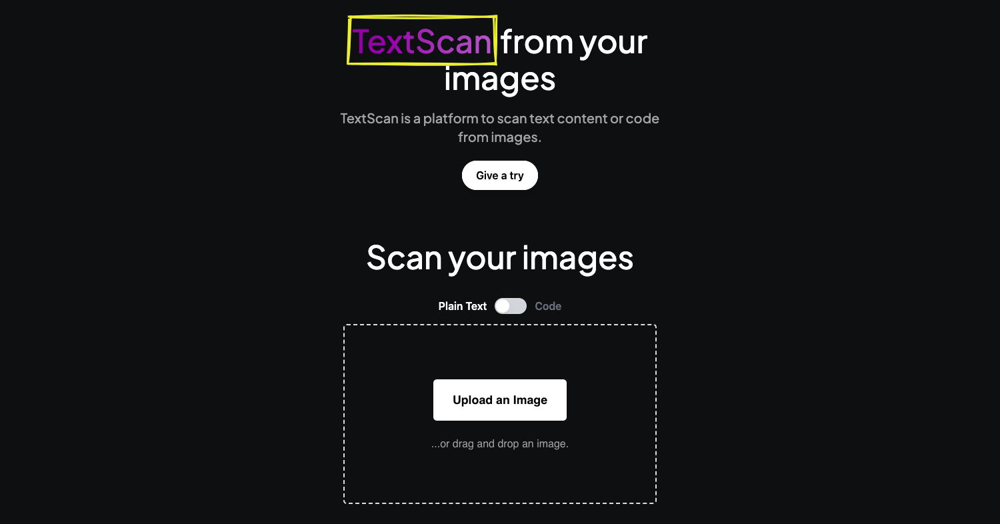

  

# Textscan

Textscan is a web app that detects and extracts text from any image using OCR(optical character recognition), a feature from [Google Cloud Vision API](https://cloud.google.com/vision/docs/ocr).

## How to run locally

1. Cone this project.
2. Run `npm install`.
3. Go to [Vision API](https://cloud.google.com/vision/docs/setup) to create an account and generate your **apikey.json**.
4. Save your **apikey.json** inside `keys` folder.
5. Run `npm run dev` and go to [localhost:3000](http://localhost:3000).

## Optional steps

You'll find a `.env.example` that has **NEXT_PUBLIC_UPLOAD_API_KEY**. To get it, follow these steps:

1. Rename `.env.example` to `.env`.
2. Go to [Upload.io](https://upload.io/) and create an account.
3. Copy your API Public Key from [Dahboard API Keys](https://upload.io/dashboard/security/api_keys).
4. Paste it on `.env` file.
